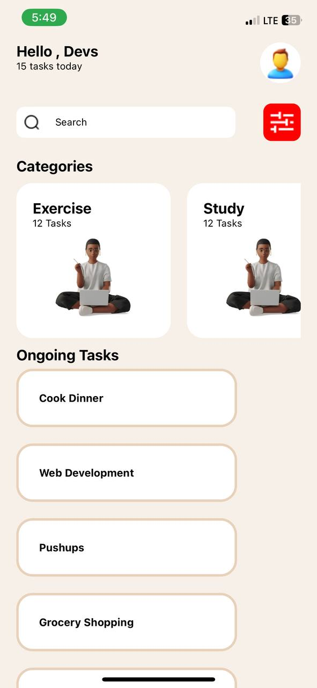

# rn-assignment3-11244739
Description:

- Frame1: This component is most likely responsible for producing a specific framework or piece of your app. The specific details could possibly vary depending on how it is executed.
- SearchBar: As the name implies, this component is most likely a search bar UI element. It enables users to enter queries for searching and interact with the search capacities of your app..
- CategorySection: This component probably represents a section of your app where different categories or topics are displayed. It could be used for organizing content or navigation.
- OngoingTask: This component might handle displaying information related to ongoing tasks or processes. It could show progress, status, or other relevant details.

Screenshot

ID:

11244739

